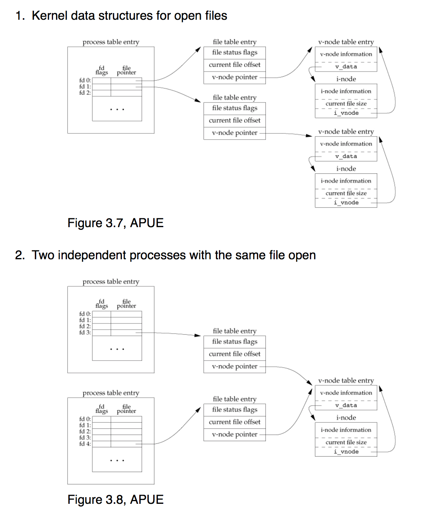
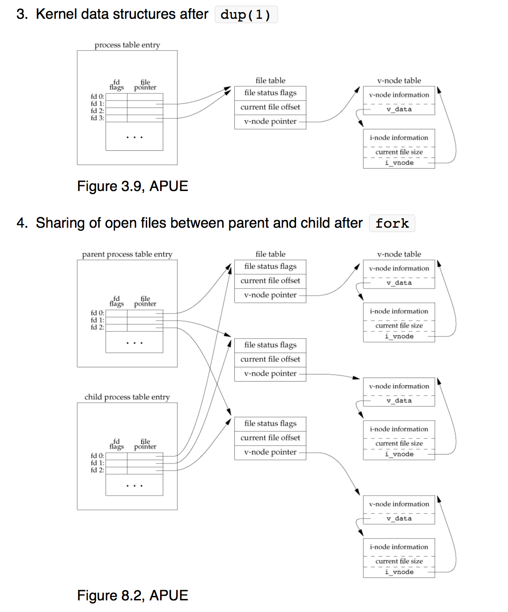

L04-File I/O
============

Reading: __APUE 10.1-10.6__, __APUE 3.1-3.13__, __APUE 8.1-8.10__
__open__:
- man open in Linux:
```c
#include <fcntl.h>
...
int fd;
mode_t mode = S_IRUSR | S_IWUSR | S_IRGRP | S_IROTH;
char *pathname = "/tmp/file";
...
fd = open(pathname, O_WRONLY | O_CREAT | O_TRUNC, mode);
...
```
- O_WRONLY: open for write only
- O_CREAT: create the file is not exist
- O_TRUNC: if an existing file is opened for O_WRONLY, its length shall be truncated to 0
- O_EXCL: if together with O_CREAT and the file already exits, open shall fail
- First call to open() will return a file descriptor of value 3 because 0,1,2 are already taken; equivalent to fopen("w");
- read man chmod to read on the values of S_IRUSR, etc
Another example - creating a lock file:

```c
fd = open("/var/run/myprog.pid", O_WRONLY | O_CREAT | O_EXCL, 0644);
```
__creat(path, mode)__: same as `open(path, O_WRONLY|O_CREAT|O_EXCL, mode);`

__close`__: `int close(int fildes);`

__lseek__: `off_t lseek(int fildes, off_t offset, int whence);`
- if whence is SEEK_SET, the file offset shall be set to offset bytes.
- if whence is SEEK_CUR, the file offset shall be set to its current location plus offset.
- if whence is SEEK_END, the file offset shall be set to the size of the file plus offset.

__read__: `ssize_t read(int fildes, void *buf, size_t nbyte);`
- returns number of bytes read, 0 if end of file, -1 on error
- numbers of bytes read may be less than the requested nbyte
- `read()` may block forever on a "slow" read from pipes, FIFOs (named pipes), sockets, or keyboard
- For sockets, `read(socket, buf, nbyte)` is equivalent to `recv(int socket, void *buffer, size_t length, int flags)`
  - normally, recv() blocks until it has received at least 1 byte
  - returns num bytes received, 0 if connection closed, -1 if error

__write__: `ssize_t write(int fildes, const void *buf, size_t nbyte);`
- returns number of bytes written, -1 on error
- numbers of bytes written may be less than the requested nbyte -ex) filling up a disk
- `write()` may block forever on slow write into pipes, FIFOs, or sockets
- For sockets, `write(socket, buf, nbyte)` is equivalent to `send(socket, buf, nbyte, 0)`
- If the files was opened with `O_APPEND` flag, the file offset gets set to the end of the file prior to each write
  - setting of the offset and writing happen in an atomic operations

#### Signals and system calls

```c
#include <stdio.h>
#include <stdlib.h>
#include <signal.h>
#include <unistd.h>

static void sig_int(int signo)
{
    printf("stop pressing ctrl-c!\n");
}

int main()
{
    if (signal(SIGINT, &sig_int) == SIG_ERR) {
        perror("signal() failed");
        exit(1);
    }

    int i = 0;
    for (;;) {
        printf("%d\n", i++);
        sleep(1);
    }
}
```
  - When pressing ctrl-c, the keyboard is connect to usb port, which raise some voltage, grab the attention of the CPU (the interruption on CPU), a piece of the OS wakes up and notices `SIGINT` and says, please quit the currently running process.
  - ctrl-c sends `SIGINT` , the `sig_int()` function is called by signal() that takes the SIGINT and does what's defined inside sig_int(), the signal handler, which gets called immediately wherever you are, maybe in the middle of malloc().
  - the sleep function always gets interrupts, therefore when keep doing the ctrl-c, it does not actually sleep for 1 sec.
  - Can also define the `sig_int()` function to ignore  by `SIG_IGN` or simply call `signal(SIGINT, SIG_IGN)`
  - To send a signal to kill a process: kill -2 11967, kill -INT 11967, that sends SIG_INT. kill can send signals if you specify
  - man 7 signal, you get the overview of signal
  - kill -TERM 11967 is the same as the default kill which gives signal 15 to terminate the process
  - cannot call SIGKILL 9 -- killing with extreme prejudice
  - this is like IPC, the kill process interrupting the ./a.out process.
  - In a real web server like Apache, signals are sent to servers to maybe make it reload a user configuration file
  - the signal() function is a function that takes an int and a function pointer and returns a function pointer.

Recall `shell2.c` from previous lectures:

```c
#include "apue.h"
#include <sys/wait.h>

static void sig_int(int);       /* our signal-catching function */

int
main(void)
{
        char    buf[MAXLINE];
        pid_t   pid;
        int     status;

loop: //reregisters the signal handler every time
        if (signal(SIGINT, sig_int) == SIG_ERR)
                err_sys("signal error");

loop: //1st attempt, does not register the signal handler every time
        printf("%% ");
        while (fgets(buf, MAXLINE, stdin) != NULL) {
                if (buf[strlen(buf) - 1] == '\n')
                        buf[strlen(buf) - 1] = 0;

                if ((pid = fork()) < 0) {
                        err_sys("fork error");
                } else if (pid == 0) {
                        execlp(buf, buf, (char star)0);
                        err_ret("couldn't execute: %s", buf);
                        exit(127);
                }

                if ((pid = waitpid(pid, &status, 0)) < 0)
                        err_sys("waitpid error");
                printf("%% ");
        }
        if(errno==EINTR) //does not actually fix the problem because if there is a big gap in before program goes to this line and two SIGINT are sent one after another immediately then the program quits.
          goto loop;
        exit(0);
}

void
sig_int(int signo)
{
        printf("interrupt\n%% "); //not suppose to call
        //printf inside sig_int(), not a reentrant function that can continue to run after a signal is shot (which messes up the data structure inside printf()), therefore it is not a safe function.
}
```
Three problems:
1. "Slow" system calls may get interrupted on signals
  - `errno` set to `EINTR` (fixing by a conditional when `fgets` returns and then use goto to restart the routine)
2. Signals get lost
  - signal handling resets after each signal (?)
3. Signal handler calls non-reentrant functions
  - A function is reentrant if it can be invoked while already in the process of executing. That is, a function is reentrant if it can be interrupted in the middle of execution (for example, by a signal or interrupt) and invoked again before the interrupted execution completes.
  - `malloc()`, `free()`, standard I/O functions -- non-reentrant

Solutions:
  - Don't use `signal()`; `use sigaction()` instead
  - From a signal handler, call only _async-signal-safe_ functions (see man 7 signal)
  - **fgets()** is the kind of function that once it receives a signal it just returns, and since there is no input it returns null and therefore goes out of the while loop and the program is terminated.

#### File sharing



- Inside the kernel there is a gigantic struct `task_struct`, for each running process. Inside the  `task_struct` has a array of other structs, for each open file you have, pointed to by file descriptors starting 3 (0,1,2 are taken). The vnode struct (in the middle layer) being pointed points to the inode struct (in Linux). In kernel memory, one inode is mapped to multiple processes opening the same file.
- Process table entires as well as middle entries are all per process.
- `seek()` simply changes the current file offset in the middle entry. Does not do much.
- `dup()` is different from opening the same file twice. It just shares the status flags. 2>&1 is essentially doing dup2(), by dup the open file 2, closing it and send the dup content to &1.
