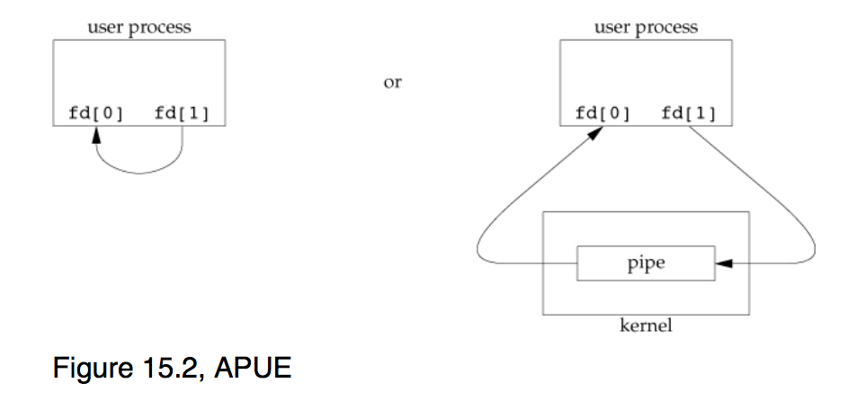
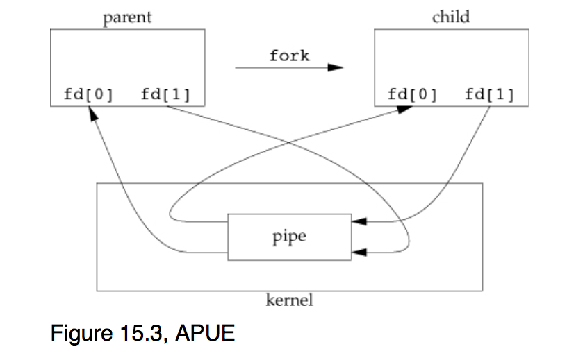
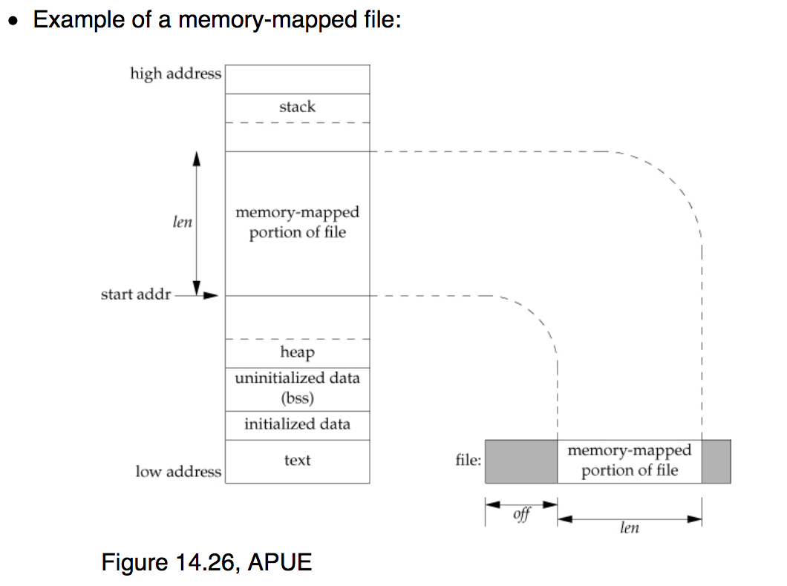

IPC in UNIX
===========

#### Pipes

- `pipe`:

```c
#include <unistd.h>

int pipe(int fd[2]);

    Returns: 0 if OK, –1 on error
```
  - After calling `pipe()`:


  - After calling `pipe()` and then fork():


  - signal is asynchronous mechanism, but pipe is synchronous
  - unnamed pipes can be used only between related processes when a common ancestor has created the pipe

- FIFOs:
  - named pipe, unrelated processes can exchange data
  - FIFO is a type of file
  - `int mkfifo(const char *path, mode_t mode);`


Sample Code:
- fork-then-open.c:

```c
#include <stdio.h>
#include <unistd.h>
#include <sys/types.h>
#include <sys/stat.h>
#include <fcntl.h>

int main()
{
    char c;
    int fd;
    mode_t mode = S_IRUSR | S_IWUSR | S_IRGRP | S_IROTH;

    const char \*pathname = "fork-then-open.out";
    if (fork() == 0)
        sleep(1);
    fd = open(pathname, O_WRONLY | O_CREAT | O_TRUNC, mode);

    for (c = 'A'; c < 'A' + 5; c++) {
        write(fd, &c, 1);
        sleep(2);
    }

    close(fd);
    return 0;
}
```

- open-then-fork.c:

```c
#include <stdio.h>
#include <unistd.h>
#include <sys/types.h>
#include <sys/stat.h>
#include <fcntl.h>

int main()
{
    char c;
    int fd;
    mode_t mode = S_IRUSR | S_IWUSR | S_IRGRP | S_IROTH;

    const char \*pathname = "open-then-fork.out";
    fd = open(pathname, O_WRONLY | O_CREAT | O_TRUNC, mode);
    if (fork() == 0)
        sleep(1);

    for (c = 'A'; c < 'A' + 5; c++) {
        write(fd, &c, 1);
        sleep(2);
    }

    close(fd);
    return 0;
}
```
- open then fork is doing 4 (prints AABBCCDDEE), fork then open is doing 2, basically (?)
- if take away sleep(1), the result may turn out to be ABCDEABCDE, which does not maintain the order but becomes in arbitrary order

#### XSI IPC:
Everything sucks, so don't use them.
- Instead of XSI message queues, use:
  - UNIX domain sockets
  - POSIX message queues (still not widely available; see man 7 mq_overview)
- Instead of XSI semaphores, use:
  - POSIX semaphores
- Instead of XSI shared memory, use:
  - memory mapping using `mmap()`

#### Memory-mapped I/O
Shared memory allows two or more processes to share a given region of memory.
- fasted IPC since the data does not have to copied between server and client
- need to synchronize access to a given region among multiple processes
- often semaphore are used to synchronize

`mmap()`:
- map portions of a file into the address space of a process
- memory space mapped with `mmap()` is backed by a file
- can be used between unrelated processes. But if related, a different technique:
  -  __/dev/zero__ is an infinite source of 0 bytes when read. This device also accepts any data that is written to it, ignoring the data
  - special proterties when gets memory mapped:
    1. An unnamed memory region is created whose size is specified in the second argument to `mmap`
    2. The memory region is initialized to zero
    3. Multiple processes can share this region if a common ancestor specifies the `MAP_SHARED` flag to `mmap`

```c
#include <sys/mman.h>

void *mmap(void \*addr, size_t len, int prot, int flag, int fd, off_t off);

    Returns: starting address of mapped region if OK, MAP_FAILED on error
```


- whatever you write into the memory region, you are writing to the file, and if you are reading from the file, you are reading from the memory, i.e virtual address space for your process
- 32 bit Linux OS are limited to 4G address space, the mapping starts at the 3G line, the top 1G is saved for the kernel. Every processes's virtual address space are all mapped to the kernel space (every 400 kb randomly into the physical memory).
- can be used instead of fread, fwrite, etc.
- dynamic linking: when linking the hello.o, does not link the library file immediately with it, but only at run time. They will look into the shared library that could be loaded into the executable at run time. In this case, the library function will not be put into the text region in the virtual memory (which static linking will do, but can cause duplication which results in waste of resources). `libc`
- shared memory between two processes ?

- APUE example:

```c
#include "apue.h"
#include <fcntl.h>
#include <sys/mman.h>

#define NLOOPS          1000
#define SIZE            sizeof(long)    /* size of shared memory area */

static int
update(long \*ptr)
{
        return((\*ptr)++);       /* return value before increment \*/
}

int
main(void)
{
        int             fd, i, counter;
        pid_t   pid;
        void    \*area;

        if ((fd = open("/dev/zero", O_RDWR)) < 0)
                err_sys("open error");
        if ((area = mmap(0, SIZE, PROT_READ | PROT_WRITE, MAP_SHARED, fd, 0)) == MAP_FAILED)
                err_sys("mmap error");
        close(fd);              /* can close /dev/zero now that it's mapped \*/

        TELL_WAIT();

        if ((pid = fork()) < 0) {
                err_sys("fork error");
        } else if (pid > 0) {                   /* parent \*/
                for (i = 0; i < NLOOPS; i += 2) {
                        if ((counter = update((long \*)area)) != i)
                                err_quit("parent: expected %d, got %d", i, counter);

                        TELL_CHILD(pid);
                        WAIT_CHILD();
                }
        } else {                                                /* child \*/
                for (i = 1; i < NLOOPS + 1; i += 2) {
                        WAIT_PARENT();

                        if ((counter = update((long \*)area)) != i)
                                err_quit("child: expected %d, got %d", i, counter);

                        TELL_PARENT(getppid());
                }
        }

        exit(0);
}
```
- can use `/dev/zero` don't care about the actual content of the file, only cares to share the memory
  - once a region is mapped, we can close the device

  - MAP_SHARED vs MAP_PRIVATE
  - `TELL_CHILD(pid); WAIT_CHILD();`  are used to have parent and child take turns to operate, through piping.

- Anonymous memory mapping:
  - same as /dev/zero mapping, but more portable and more convenient
  - don't have to `open("/dev/zero",..)` and `close(fd)`
  - change `mmap` call to :

  ```c
  if ((area = mmap(0, SIZE, PROT_READ | PROT_WRITE, MAP_ANON | MAP_SHARED, -1, 0)) == MAP_FAILED)
  ```
  - create a memory region that can be shared with descendant processes
- the /dev/zero and MAP_ANON only works between the parent and child, but if there is a actual file that has some bytes of it mapped to multiple processes, then those processes will need a rendezvous point in the physical memory.

#### POSIX Semaphores:
  - What is semaphore:
    - binary vs counting semaphores
  - creating, opening, closing, and removing named POSIX semaphores:

  ```c
  #include <semaphore.h>

  sem_t \*sem_open(const char \*name, int oflag, ... /* mode_t mode, unsigned int value  \*/ );
        Returns: Pointer to semaphore if OK, SEM_FAILED on error

  int sem_close(sem_t \*sem);
        Returns: 0 if OK, –1 on error

  int sem_unlink(const char \*name);
        Returns: 0 if OK, –1 on error

  ```
  - Initializing and destroying unnamed POSIX semaphores:
  ```c
  #include <semaphore.h>

  int sem_init(sem_t \*sem, int pshared, unsigned int value);
        Returns: 0 if OK, –1 on error

  int sem_destroy(sem_t \*sem);
        Returns: 0 if OK, –1 on error
  ```
  - using POSIX semaphores:
  Decrement the value of semaphores:
  ```c
  #include <semaphore.h>

  int sem_trywait(sem_t \*sem);
  int sem_wait(sem_t \*sem);
        Both return: 0 if OK, –1 on error
  ```
    - `trywait` is non-blocking version of `wait`

  Decrement with bounded waiting:
  ```c
  #include <semaphore.h>
  #include <time.h>

  int sem_timedwait(sem_t \*restrict sem,
                  const struct timespec \*restrict tsptr);
        Returns: 0 if OK, –1 on error
  ```

  Incrementing the value of semaphores:
  ```c
  #include <semaphore.h>

  int sem_post(sem_t \*sem);
        Returns: 0 if OK, –1 on error
  ```
  - the initial value/count tells you how many processes can have the semaphore at the same time.
  - if 5 processes calls `sem_open()` and have the `oflag` set as `CREAT`, then 1 of them will create the file and the other 4 just open it.
  - `sem_unlink()` : get rid of a name of the file. When there is just one name left, delete the file.
  - all synchronization mechanism are cooperative (meaning can choose not to wait)
  - grabbing sb's semaphore is an atomic action
  - named vs unnamed
