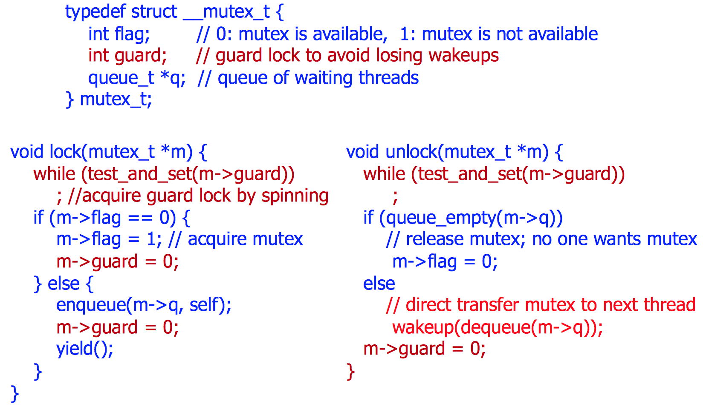

L11-Synchronization
====================

Reading: __OSC Chapter 5.1-5.5__

__race condition__: several processes access and manipulate the same data concurrently and the outcome of the execution depends on the particular order in which the access takes place.

To avoid race condition: ensure that only one process/thread at a time can be manipulating the variables in the _critical section_. __requires synchronization__.


__critical section__: process may be changing common variables, updating a table, writing a file, etc.
  - _critical-section problem_ is to design a protocol that the processes can use to cooperate. Each process must request (implemented in the entry section) permission to enter its critical section.
  - the remaining code is the remainder section
  - critical section requirements: safety, liveness, bounded
    - safety: allow just a certain amount of threads, mutual exclusion/semaphore
    - liveness: must allow at least one on proceed, i.e not a deadlock scenario
    - Bounded waiting: absolute bounds are hard to achieve in some cases but can minimize the possibility that one thread always get unlucky
  - critical section desirable properties: efficient, fair, simple
    - Efficient: don't consume too much resource while waiting
    - Fair: don't make one thread waiting longer than others, maybe use a condition variables  `pthread_cond_wait()`.

two kinds of locks: spin lock, sleeping lock (semaphore, mutex...)
  - sleeping is a very expensive operation, in contrast sometimes it is better to use lock, which keeps checking.
  - mutex_lock can only we used this way, sem_lock can be used in many other ways. (This way is to create mutual exclusion such that)
  - mutex_lock() can have multiple threads try to call it, only one will get through but the function is not necessarily an atomic function (which can include multiple underlying instructions).

#### Implementing Locks
- Lock Version 1:
  - cheat on uniprocessor to implement locks by disabling and enabling interrupts
  - If only one CPU and disable the interrupt, then there will be no race conditions, only one proceed at a time.
  - does not work anymore because multiple CPUs nowadays
- Lock Version 2:
  - Assumptions:
    - how to do mutual exclusion purely from software, without any help from the os.
    - instructions are atomic (meaning no i++ which has three instructions);
    - they execute in order (not know);
  - three wrong attempts, check out the slides P11-14
    - 2nd is the intent solution, 3rd is the turn solution
    - 3rd attempt almost work, but does not allow one thread to obtain the lock twice instead of keep alternating. (but does ensure mutual exclusion)
  - __Peterson's algorithm__ combines 2nd and 3rd attempts. Current thread who owns the lock waits for the other guy's turn and if he actually wants it, hands the lock over. Otherwise, current thread just keeps the lock. If both thread keep try to obtain the lock, the lock will take turn.
    - requires two processes/threads to share two data items:
    ```c
    int turn;
    boolean flag[2];
    ```
    - The variable turn indicates whose turn it is to enter its critical section. That is, if turn == i, then process Pi is allowed to execute in its critical section. The _flag_ array is used to indicate if a process is ready to enter its critical section.
    - To enter the critical section, process Pi first sets `flag[i]` to be `true` and then set `turn` to the value `j`, thereby asserting that if the other process wishes to enter the critical section, it can do so. If both processes try to enter at the same time, turn will be set to both i and j at roughly the same time. Only one of these assignments will last; the other will occur but will be overwritten immediately. The eventual value of turn determines which of the two processes is allowed to enter its critical section first.
    - Peterson's algorithm only works for two threads and therefore is limited
    - N>2 threads? (Lamport's Bakery algorithm)
    - Modern processors do reorder instructions, therefore Peterson's algorithms does not work (affects locking in general)
    - can be fixed by Memory Barriers/Fence, definition: ensures that all memory operations up to the barrier have to be executed before proceeding
- Lock Version 3:
    - Hardware mechanism which all the lockings rely on
    - test_and_set(): translates the action to test and modify a the content of a word or to swap the contents of two words atomically, that is, as one uninterruptible unit. i.e, a single CPU instruction
    - if the flag is 0 to begin with , in one shot `test_and_set()` sets it to 1 but return 0 to have the while loop evaluate to false. This kind of mechanism has no gap between evaluating the while loop to false and then change the flag to 1. At the meantime, all the other thread are waiting with `while(1)` until that particular thread unlocks which changes the flag to 0 and then compete to grab the 0 flag in order to proceed. P21
    - implemented in assembly
    
    - this is spin lock, because it keeps spinning in the `while(1)` loop
    - spin lock typically are not available in user program. and spin lock does not make sense in single CPU (at least less efficient, why not go straight to sleep bc the timer will break the spin anyones in uniprocessor), because it requires multiple processes running at the same time
- Lock Version 4: (sleeping locks)
    - yield inside the while loop (put to sleep, i.e save the current status to the stack/register and switch to another process)
    - Potential problems:
      - lost wake up
      
      - wrong thread gets lock
      
    - fix: used a struct that uses a guard lock to directly transfer the lock to waiting thread
    
- cons of Spinlocks: inefficient if the lock is held to too long duration -- if a single CPU is shared among many processes, busy waiting wastes CPU cycles that some other process might be able to use productively.
- cons of Sleeplocks: higher overhead since always have to load and save to/from the register in order to keep up with the state maintenance.
