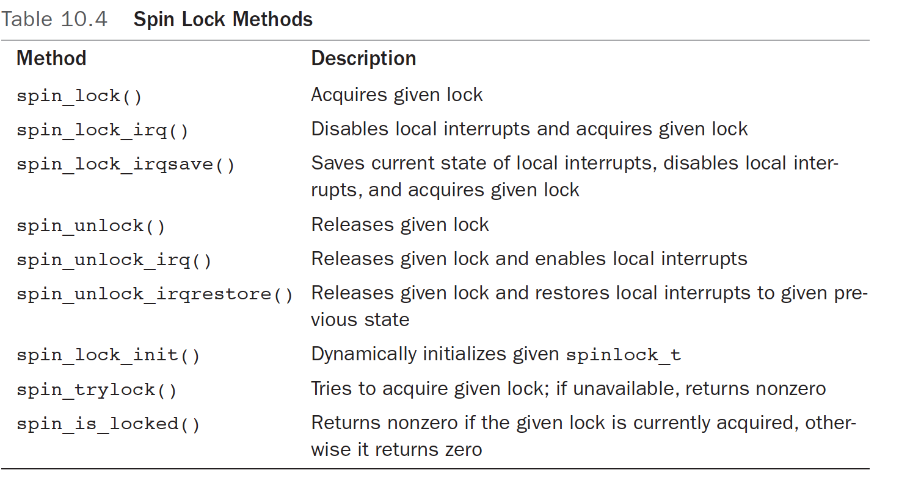
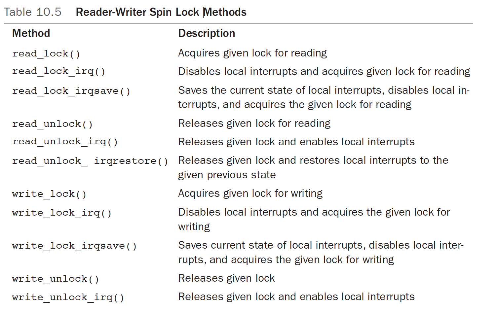
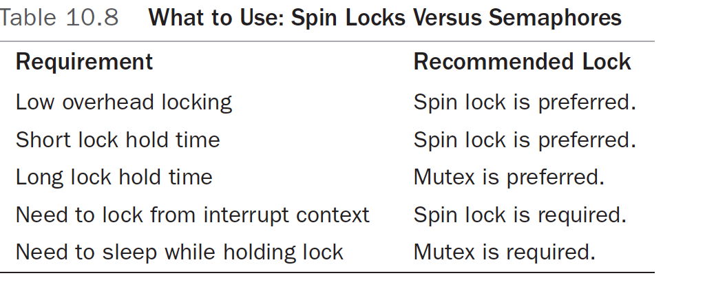
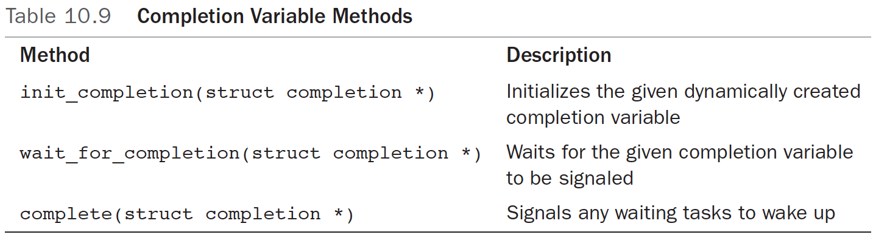
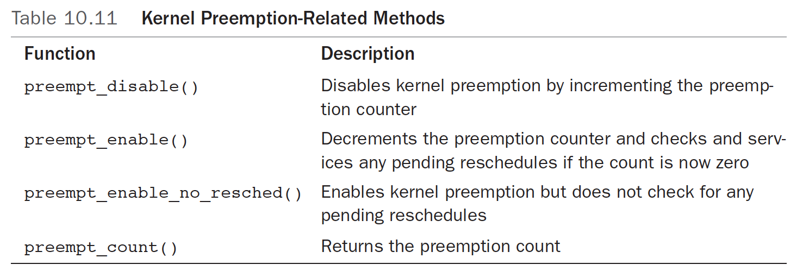

Locks
==========

#### Spin Locks
- Critical regions not only contains merely incrementing a variable, it also spans multiple functions. That's why we need a more general method os synchronization: locks. (In addition to making incrementing operations atomic)
- A spin lock is a lock that can be held by at most one thread of execution.
  - If a thread of execution attempts to acquire a spin lock while it is contended, the thread busy loops -- spins -- waiting for the lock to become available. Thus prevents more than one thread of execution from entering the critical region at any one time.
  - A contended spin lock causes threads to spin while waiting for the lock to become available is salient, so it is not wise to hold a spin lock for a long time.
    - Nature of spin lock: a lightweight single-holder lock that should be held for short durations.
    - Alternative: sleep lock, put the current thread to sleep and wake it up when it becomes available. Then the processor can go off and execute other code. This incurs a bit of overhead -- like a semaphore does.

#### Spin Lock Methods
- Spin locks are architecture-dependent and implemented in assembly. The architecture-dependent code is defined in <asm/spinlock.h>. The actual usable interfaces are defined in <linux/spinlock.h>. The basic use of a spin lock is:

```c
DEFINE_SPINLOCK(mr_lock);
spin_lock(&mr_lock);
/* critical region*/
spin_unlock(&mr_lock);
```
- Has to be on multiprocessor machines and kernel preempt has to be on.
- Linux kernel's spin locks are not recursive. Meaning cannot try to obtain the lock you already hold!

- Spin locks can be used in interrupt handlers, whereas semaphores cannot be used because they sleep.
  - When used in an interrupt handler, must disable local interrupts before obtaining the lock. Otherwise, it is possible for an interrupt handler to interrupt kernel code while the lock is held and attempt to reacquire the lock. The interrupt handler spins, waiting for the lock to become available. The lock holder, however, does not run until the interrupt handler completes.
  - You only need to disable interrupts only on the current processor. If an interrupt occurs on a different processor, and it spins on the same lock, it does not prevent the lock holder releasing the lock.
- The kernel provides an interface that conveniently disables interrupts and acquires the lock. Usage:

```c
DEFINE_SPINLOCK(mr_lock);
unsigned long flags;

spin_lock_irqsave(&mr_lock, flags);
/*critical region ... */
spin_unlock_irqrestore(&mr_lock, flags);
```
`spin_lock_irqsave()` saves the current state of interrupts, disables them locally, and then obtains the given lock. Conversely, `spin_unlock_irqrestore()` unlocks the given lock and returns interrupts to their previous state. This way, if interrputs were initially disables, your code would not erroneously enable them, but instead keep them disables. _flags_ variable is passed by value because the lock routines are implemented partially as macros.

#### Other Spin Lock Methods
`spin_lock_init()`: initializes a dynamically created spin lock
`spin_trylock()` attempts to obtain the given spin lock. If the lock is contended, rather than spin and wait for the lock to be released, the function immediately returns zero. If is succeeds in obtaining the lock, it returns nonzero
`spin_islocked()` returns nonzero is the given lock is currently acquired. Otherwise it returns zero.

Complete List of standard spin lock methods:


#### Spin locks and Bottom Halves
- certain locking precautions must be taken when working with bottom halves. The function `spin_lock_bh()` obtains the given lock and disables all bottom halves. `spin_unlock_bh()` performs the inverse.

#### Reader-Writer Spin locks
- writing demands mutual exclusion, while reading, it is only important that nothing else writes to the same area.
- reader/writer locks are sometimes called _shared/exlusinve_ or _concurrent/exclusive locks_ because the lock is available in a shared (for readers) and an exclusive (for writers) form.

Usage:

```c
DEFINE_RWLOCK(&mr_rwlock);
// Then in the reader code path:
read_lock(&mr_rwlock);
/*critical section (read only) ... */
read_unlock(&mr_rwlock);
// in the writer code path:
write_lock(&mr_rwlock);
/*critical section  (read and write)...*/
write_unlock(&mr_lock);
```
- Assumes readers and writers are in entirely separate code paths, such as in the example above.
- cannot "upgrade" a read lock to a write lock, which will result in deadlock, like the following code:

```c
read_lock(&mr_rwlock);
write_lock(&mr_rwlock);
```

Reader_writer spin lock methods:

Plus the following three methods:
`write_unlock_irqrestore()`: Releases given lock and restores local interrupts to given previous state
`write_trylock()`: Tries to acquire given lock for writing; if unavailable, returns nonzero
`rwlock_init()`: Initializes given `rwlock_t`

- Linux reader_writer spin locks favors readers over writers. If the read lock is held and a writer is waiting for exclusive access, readers that attempt to acquire the lock continue to succeed. The spinning writer does not acquire the lock until all readers release the lock. Therefore, a sufficient number of readers can starve pending writers.

#### Semaphore and mutex
The simplicity and efficiency of the mutex comes from the additional constraints it imposes on its users over and above what the semaphore requires. Unlike a semaphore, which implements the most basic of behavior in accordance with Dijkstra's original design, the mutex has a stricter, narrower use case:
  - Only one task can hold the mutex at a time. That is, the usage count on a mutex is always one.
  - Whoever locked a mutex must unlock is. That is, you cannot lock a mutex in one context and then unlock it in another. This means that the mutex isn't suitable for more complicated synchronizations between kernel and user-space. Most use cases cleanly lock and unlock from the same context.
  - Recursive locks and unlocks are not allowed. That is, you cannot recursively acquire the same mutex, and you cannot unlock an unlocked mutex.
  - A process cannot exit while holding a mutex.
  - A mutex cannot be acquired by an interrupt handler or bottom half, even with mutex_trylock()
  - A mutex can be managed only via the official API: It must be initialized via the methods described in this section and cannot be copies, hand initialized, or reinitialized.

#### Semaphores VS Mutexes
- the formula dictating which to use is quite simple: Unless one of mutex's additional constraints prevent you from using them, prefer the new mutex type to semaphores. When writing new code, only specific, often low-level, uses need a semaphore.

#### Spin Locks Versus Mutexes


#### Completion Variables
Using _completion variables_ is an easy way to synchronize between two tasks in the kernel when one task needs to signal to the other that an event has occurred.
- One task waits on the completion variable while another task performs some work. When the other task has completed the work, it uses the completion variable to wake up any waiting tasks. Much like a semaphore.
  - The vfork() system call uses completion variables to wake up the parent process when the child process execs or exits.
- represented by the `struct completion` type, defined in `<linux/completion.h>`. A statically created completion variable is created and initialized via
`DECLARE_COMLETION(mr_comp);`
or
`init_completion()` for dynamic allocation
- On a given completion variable, the tasks that want to wait call `wait_for_completion()`. After the event has occurred, calling `complete()` signals all waiting tasks to wake up.

completion variable methods:


- For sample usages of completion variables, see __kernel/sched.c__ and __kernel/fork.c__.

#### BKL: The Big Kernel Locks
BKL is a global spin lock that was created to ease the transition from Linux's original SMP implementation to fine_grained locking.

#### Sequential Locks
The _sequential lock_, generally shortened to _seq lock_, is a newer type of lock introduced in the 2.6 kernel. It provides a simple mechanism for reading and writing shared data. It works by maintaining a sequence counter. Whenever the data in question is written to, a lock is obtained and a sequence number is incremented. Prior to and after reading the data, the sequence number is read. If the values are the same, a write did not begin in the middle of the read. Further, if the values are even, a write is not underway.
- More details, LKD P200

#### Preemption Disabling
__Kernel preemption__: Kernel preemption is a method used mainly in monolithic and hybrid kernels where all or most device drivers are run in kernel space, whereby the scheduler is permitted to forcibly perform a context switch (i.e. preemptively schedule; on behalf of a runnable and higher priority process) on a driver or other part of the kernel during its execution, rather than co-operatively waiting for the driver or kernel function (such as a system call) to complete its execution and return control of the processor to the scheduler.

- Because the kernel is preemptive, a process in the kernel can stop running at any instant to enable a process of higher priority to run. This means a task can begin running in the same critical region as a task that was preempted. To prevent this, the kernel preemption code uses spin locks as markers of nonpreemptive regions. If a spin lock is held, the kernel is not preemptive. Because the concurrency issues with kernel preemption and SMP are the same, and the kernel is already SMP-safe; this simple change makes the kernel preempt-safe, too.

- In reality, some situations do not require a spin lock, but do need kernel preemption disabled. The most frequent of these situations is per-processor data. If the data is unique to each processor, there might be no need to protect it with a lock because only that one processor can access the data. If no spin locks are held, the kernel is preemptive, and it would be possible for a newly scheduled task to access this same variable.

- To solve this, kernel preemption can be disabled via `preempt_disable()`. The call is nestable; you can call it any number of times. For each call, a corresponding call to `preempt_enable()` is required. The final corresponding call to `preempt_enable()` reenables preemtion. eg:
```c
preempt_disable();
/*preemption is disabled...*/
preempt_enable();
```
The preemption count stores the number of held locks and `preempt_diable()` calls. If the number is zero, the kernel is preemptive. If the value is one or greater, the kernel is not preemptive. This count is incredibly useful -- it is a great way to do atomicity and sleep debugging. The function `preempt_count()` returns this value.

Kernel Preemption-Related Methods:


As a cleaner solution to per-processor data issues, you can obtain the processor number (which presumably is used to index into the per-processor data) via `get_cpu()`. This function disables kernel preemption prior to returning the current processor number:
```c
int cpu;

/*disable kernel preemption and set "cpu" to the current processor*/
cpu = get_cpu();

/*manipulate per-processor data...*/
/*reenable kernel preemption, "cpu" can change and so is no longer value*/
put_cpu();
```
