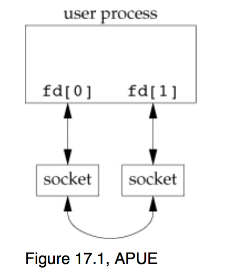
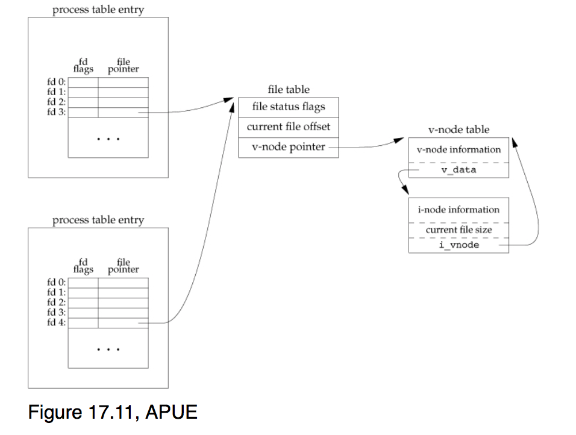

UNIX domain sockets
===================
#### UNIX IPC so far
- Shared memory
- synchronization
- pipe (half-duplex)
- FIFO (using a pipe file)
- TCP socket
- UDP socket


- UNIX domain sockets
  - socketpair creates a full duplex pipe
  - can be used as a local-only socket sing socket API
  -  __reliable when used in datagram mode__
  - can __transport special things like open file descriptor__

- Full duplex pipe using `socketpair()`:

```c
int socketpair(int domain, int type, int protocol, int sv[2]);

        Returns 0 if OK, -1 on error
```
  - same picture as the one for `pipe()` but arrows going both ways

  

- Example of exchanging datagram using domain socket
recv-unix.c:

```c
#include "apue.h"
#include <sys/socket.h>
#include <sys/un.h>
#include <errno.h>

static void die(const char *m) { perror(m); exit(1); }

int main(int argc, char **argv)
{
    if (argc != 3) {
        fprintf(stderr, "usage: %s <domain-sock-name> <num-chars>\n", argv[0]);
        exit(1);
    }

    const char *name = argv[1];
    int num_to_recv = atoi(argv[2]);

    struct sockaddr_un  un;

    if (strlen(name) >= sizeof(un.sun_path)) {
        errno = ENAMETOOLONG;
        die("name too long");
    }

    int fd, len;

    // create a UNIX domain datagram socket
    if ((fd = socket(AF_UNIX, SOCK_DGRAM, 0)) < 0)
        die("socket failed");

    // remove the socket file if exists already
    unlink(name);

    // fill in the socket address structure
    memset(&un, 0, sizeof(un));
    un.sun_family = AF_UNIX;
    strcpy(un.sun_path, name);
    len = offsetof(struct sockaddr_un, sun_path) + strlen(name);

    // bind the name to the descriptor
    if (bind(fd, (struct sockaddr \*)&un, len) < 0)
        die("bind failed");

    char buf[num_to_recv + 1];

    for (;;) {
        memset(buf, 0, sizeof(buf));
        int n = recv(fd, buf, num_to_recv, 0);
        if (n < 0)
            die("recv failed");
        else
            printf("%d bytes received: \"%s\"\n", n, buf);
    }

    close(fd);
    unlink(name);
    return 0;
}
```
send-unix.c:

```c
#include "apue.h"
#include <sys/socket.h>
#include <sys/un.h>
#include <errno.h>

static void die(const char *m) { perror(m); exit(1); }

int main(int argc, char **argv)
{
    if (argc != 4) {
        fprintf(stderr, "usage: %s <domain-sock-name> <msg> <num-repeat>\n", argv[0]);
        exit(1);
    }

    const char *name = argv[1];
    const char *msg = argv[2];
    int num_repeat = atoi(argv[3]);

    struct sockaddr_un  un;

    if (strlen(name) >= sizeof(un.sun_path)) {
        errno = ENAMETOOLONG;
        die("name too long");
    }

    int fd, len, i;

    // create a UNIX domain datagram socket
    if ((fd = socket(AF_UNIX, SOCK_DGRAM, 0)) < 0)
        die("socket failed");

    // fill in the socket address structure with server's address
    memset(&un, 0, sizeof(un));
    un.sun_family = AF_UNIX;
    strcpy(un.sun_path, name);
    len = offsetof(struct sockaddr_un, sun_path) + strlen(name);

    for (i = 0; i < num_repeat; i++) {
        int n = sendto(fd, msg, strlen(msg), 0, (struct sockaddr \*)&un, len);
        if (n < 0)
            die("send failed");
        else
            printf("sent %d bytes\n", n);
    }

    close(fd);
    return 0;
}
```
  - when used as a local-only socket using sockets API, which is what UNIX domain socket is designed for, and using the same routines like bind listen accept, just create the socket to be a UNIX domain socket instead of TCP socket.
  - Specifically created for long running services, need to move sessions from one process to another, even btw computers.
  - sockaddr_un (un for Unix domain sockets, in for internet TCP sockets)
  - fd = socket(AF_UNIX, SOCK_DGRAM, 0)
  - unlink: removing a file
  - bind actually creates a file in local area for UNIX domain sockets, a rendezvous point for IP and port number.
  - sudo find / -type s (finding all the socket type files)
  - recv-unix.c (maintains the num-chars, different form TCP which receives anything sent, if the sent message is longer than num-chars, the message will just be cutoff)

- Passing the file descriptors
  - duplicate a file descriptor across running processes
  
  - This picture can be reached by UNIX domain socket, but also can be reached though calling dup() and then fork(). One process close fd3 and the other close fd4.
