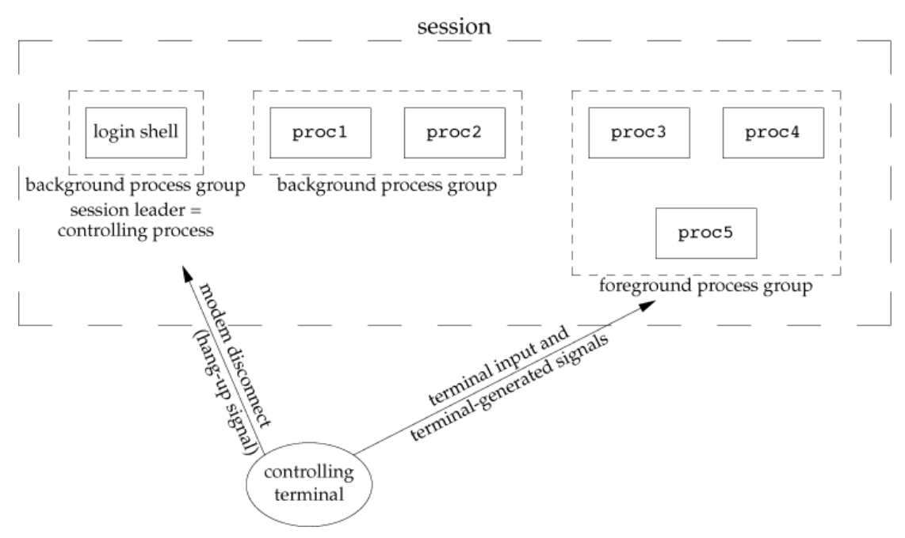

Signal
======

After issuing the following commands:
```
proc1 | proc2 &
proc3 | proc4 | proc5
```
You have:


- &, fg, ^z(go back to the background, a signal sent) and bg
- SIGHUP (hang up): analogy: hanging up the phone  vs closing the terminal window. modem gets disconnected, SIGHUP is send to the login shell and it kills all the processes and cleans things up
- daemon: a daemon is a computer program that runs as a background process, rather than being under the direct control of an interactive user. (as a child process of init)
- ps fxj: PPID, PID, PGID, SID, TTY, TPGID, STAT, UID, COMMAND. f for --forest to show the tree structure
- cannot send kill signal to the processes that are not owned by you (can kill processes with your own pid and signal number).

#### Sending signals
```c
#include <signal.h>

int kill(pid_t pid, int signo);

int raise(int signo);

        Both return: 0 if OK, –1 on error
```
- `int raise(signo)` == `int kill(getpid(), signo)`
- four conditions for the pid argument to kill:
  - pid > 0: signal is sent to the process whose process ID is pid
  - pid == 0: signal is sent to all processes whose group ID equals the process group ID of the sender and for which the sender has permission to send the signal
  - pid < 0: signal is sent to all processes whose `pgid == |pid|` and for which the sender has permission to send the signal
  - pid == 1: signal is sent to all processes on the system for which the sender has permission to send the signal
- a process needs permission to send a signal to another process.
- signo 0 is the null signal. If the signo argument is 0, then the normal error checking is performed by kill, but no signal is sent

#### SIGALRM
__alarm() and pause() functions__
```c
#include <unistd.h>

unsigned int alarm(unsigned int seconds);
        Returns: 0 or number of seconds until previously set alarm

int pause(void);
        Returns: –1 with errno set to EINTR
```

- `alarm(0)` cancels the previous alarm if one was set
- alarm() & pause() can be used to implement `sleep()`, but there are many subtleties.

```c
#include "apue.h"

static void sig_alrm(int);

int
main(void)
{
    int     n;
    char    line[MAXLINE];

    if (signal(SIGALRM, sig_alrm) == SIG_ERR)
        err_sys("signal(SIGALRM) error");

    alarm(10);
    if ((n = read(STDIN_FILENO, line, MAXLINE)) < 0)
        err_sys("read error");
    alarm(0);

    write(STDOUT_FILENO, line, n);
    exit(0);
}

static void
sig_alrm(int signo)
{
    /* nothing to do, just return to interrupt the read \*/
}
```

potential problems with the code:
1. a race condition: the alarm can be missed between `alarm(10)` and `read()`. Can have an interval  (if there is a huge gap in between two lines) caused by os scheduling that mistakenly interrupts read before the inputs are read by the read() such that it reports error.

2. doesn't work if slow systems calls are automatically restarted. (BSD's)

__Crude solutions__:
  - setjmp & longjmp (cross-functional goto), when calling longjmp, it is returning from setjmp. (read() is possibly restarted)
  - solves everything by quitting
  - when a process is hung by the os and a signal is shot from the process, the os will remember the signal and when come back to the process, os tells the process to handle it.

__Real solutions__:

#### sigprocmask() & sigpending() functions

```c
#include <signal.h>

int sigprocmask(int how, const sigset_t \*restrict set,
                sigset_t \*restrict oset);

        how: SIG_BLOCK, SIG_UNBLOCK, or SIG_SETMASK

        Returns: 0 if OK, –1 on error

int sigpending(sigset_t \*set);

        Returns: 0 if OK, –1 on error
```
  - sigprocmask() is used to change the list of currently blocked signals. The behavior is dependent on the value `how`.
  - sigpending(), which tells you the status of a certain signal that is pending (ones that have been raised while blocked). The signal mask of pending signals is stored in set

#### Signal sets

```c
#include <signal.h>

int sigemptyset(sigset_t \*set);

int sigfillset(sigset_t \*set);

int sigaddset(sigset_t \*set, int signo);

int sigdelset(sigset_t \*set, int signo);

        All four return: 0 if OK, –1 on error

int sigismember(const sigset_t \*set, int signo);

        Returns: 1 if true, 0 if false, –1 on error
```
A possible implementation:

```c
#define sigemptyset(ptr)  (*(ptr) = 0)
#define sigfillset(ptr)   (*(ptr) = ~(sigset_t)0, 0)

/*
 * <signal.h> usually defines NSIG to include signal number 0.
 */
#define SIGBAD(signo)   ((signo) <= 0 || (signo) >= NSIG)

int sigaddset(sigset_t \*set, int signo)
{
    if (SIGBAD(signo)) {
        errno = EINVAL;
        return(-1);
    }
    \*set |= 1 << (signo - 1);       /* turn bit on \*/
    return(0);
}

int sigdelset(sigset_t \*set, int signo)
{
    if (SIGBAD(signo)) {
        errno = EINVAL;
        return(-1);
    }
    \*set &= ~(1 << (signo - 1));    /* turn bit off \*/
    return(0);
}

int sigismember(const sigset_t \*set, int signo)
{
    if (SIGBAD(signo)) {
        errno = EINVAL;
        return(-1);
    }
    return((\*set & (1 << (signo - 1))) != 0);
}
```
  - In the expression `*set &= ~(1 << (signo - 1));` in `sigdelset`:
    - signo - 1 sets the counting of signo to start from 0
    - 1 << (signo - 1): raise to 2 to the power (signo - 1), which is in the form of 00...00100...00
    - ~( 1 << (signo - 1)): flip all binary digits to become 11...11011...11;
    - `*set &= ~(1 << (signo - 1));` turns the corresponding bit to signo off;

  - SIGQUIT: ^/
  - os only queues up 1 of the multiple same signals.

#### sigaction() function

```c
#include <signal.h>

int sigaction(int signo, const struct sigaction \*restrict act,
              struct sigaction \*restrict oact);

        Returns: 0 if OK, –1 on error

struct sigaction {
  void     (\*sa_handler)(int);  /* addr of signal handler, \*/
                                /* or SIG_IGN, or SIG_DFL \*/
  sigset_t sa_mask;             /* additional signals to block \*/
  int      sa_flags;            /* signal options, Figure 10.16 \*/
  /* alternate handler \*/
  void     (\*sa_sigaction)(int, siginfo_t \*, void \*);
};
```
- signal() has a number of undesirable characteristics that sigaction() avoids
  1. The signal() function does not necessarily block other signals from arriving while the current handler is executing; `sigaction()` can block other signals until the current handler returns.
  2. The signal() function usually __resets the signal action back to `SIG_DEL` (default) for almost all signals__. This means that the `signal()` handler must reinstall itself as its first action. It also opens up a window of vulnerability between the time when the signal is detected and the handler is reinstalled during which if a second instance of the signal arrives, the default behavior occurs.
  3. The exact behavior of `signal()` varies between systems -- and the standards permit those variations.

- An implementation of `signal()` using `sigaction`:

```c
#include "apue.h"

/* Reliable version of signal(), using POSIX sigaction().  */
Sigfunc *
signal(int signo, Sigfunc \*func)
{
    struct sigaction    act, oact;

    act.sa_handler = func;
    sigemptyset(&act.sa_mask);
    act.sa_flags = 0;
    if (signo == SIGALRM) {
#ifdef  SA_INTERRUPT
        act.sa_flags |= SA_INTERRUPT;
#endif
    } else {
        act.sa_flags |= SA_RESTART;
    }
    if (sigaction(signo, &act, &oact) < 0)
        return(SIG_ERR);
    return(oact.sa_handler);
}
```
1. signal handler remains in place
2. Interrupted system calls automatically restart, except for SIGALRM

signal_intr() - an alternate version that does not restart system calls:

```c
#include "apue.h"

Sigfunc *
signal_intr(int signo, Sigfunc \*func)
{
    struct sigaction    act, oact;

    act.sa_handler = func;
    sigemptyset(&act.sa_mask);
    act.sa_flags = 0;
#ifdef SA_INTERRUPT
    act.sa_flags |= SA_INTERRUPT;
#endif
    if (sigaction(signo, &act, &oact) < 0)
        return(SIG_ERR);
    return(oact.sa_handler);
}
```
