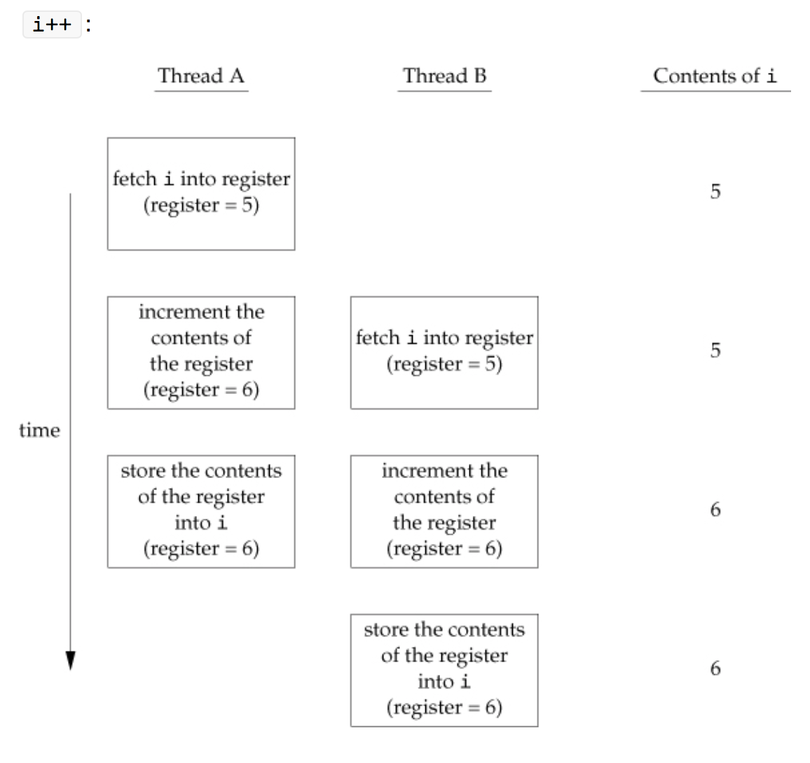

POSIX threads
=============
#### Create, exit, join

```c
#include <pthread.h>

int pthread_create(pthread_t \*restrict tidp,
                   const pthread_attr_t \*restrict attr,
                   void \*(\*start_rtn)(void \*), void *restrict arg);

        Returns: 0 if OK, error number on failure

void pthread_exit(void \*rval_ptr);

int pthread_join(pthread_t thread, void \**rval_ptr);

        Returns: 0 if OK, error number on failure
```

- General approach:
  - write a pthreadfunction for the task that the thread will do, pass it as the third argument
  - define a struct that contains parameters you want to pass into the pthreadfunction
  - configure pthread_attr_t \*attr, pthread_attr_init(&attr), set to detach mode, etc

#### Thread synchronization problem



#### mutex

```c
#include <pthread.h>

int pthread_mutex_init(pthread_mutex_t \*restrict mutex,
                       const pthread_mutexattr_t \*restrict attr);

int pthread_mutex_destroy(pthread_mutex_t \*mutex);

        Both return: 0 if OK, error number on failure

int pthread_mutex_lock(pthread_mutex_t \*mutex);

int pthread_mutex_trylock(pthread_mutex_t \*mutex);

int pthread_mutex_unlock(pthread_mutex_t \*mutex);

        All return: 0 if OK, error number on failure

#include <pthread.h>
#include <time.h>

int pthread_mutex_timedlock(pthread_mutex_t \*restrict mutex,
                            const struct timespec \*restrict tsptr);

        Returns: 0 if OK, error number on failure
```
#### deadlock
- Deadlock condition:
  1. A thread tries to lock the same mutex twice
  2. A thread hold mutex A and tries to lock mutex B, and another thread holds mutex B and tries to lock mutex A
- Strict lock ordering avoids deadlock
- See APUE 11.11 and 11.12 for examples of using two mutexes

#### Reader-writer lock

```c
#include <pthread.h>

int pthread_rwlock_init(pthread_rwlock_t \*restrict rwlock,
                        const pthread_rwlockattr_t \*restrict attr);

int pthread_rwlock_destroy(pthread_rwlock_t \*rwlock);

        Both return: 0 if OK, error number on failure

int pthread_rwlock_rdlock(pthread_rwlock_t \*rwlock);

int pthread_rwlock_wrlock(pthread_rwlock_t \*rwlock);

int pthread_rwlock_unlock(pthread_rwlock_t \*rwlock);

        All return: 0 if OK, error number on failure

int pthread_rwlock_tryrdlock(pthread_rwlock_t \*rwlock);

int pthread_rwlock_trywrlock(pthread_rwlock_t \*rwlock);

        Both return: 0 if OK, error number on failure

#include <pthread.h>
#include <time.h>

int pthread_rwlock_timedrdlock(pthread_rwlock_t \*restrict rwlock,
                               const struct timespec \*restrict tsptr);

\
        Both return: 0 if OK, error number on failure
```

#### Condition variables

```c
#include <pthread.h>

int pthread_cond_init(pthread_cond_t \*restrict cond,
                      const pthread_condattr_t \*restrict attr);

int pthread_cond_destroy(pthread_cond_t \*cond);

        Both return: 0 if OK, error number on failure

int pthread_cond_wait(pthread_cond_t \*restrict cond,
                      pthread_mutex_t \*restrict mutex);

int pthread_cond_timedwait(pthread_cond_t \*restrict cond,
                           pthread_mutex_t \*restrict mutex,
                           const struct timespec \*restrict tsptr);

        Both return: 0 if OK, error number on failure

int pthread_cond_signal(pthread_cond_t \*cond);

int pthread_cond_broadcast(pthread_cond_t \*cond);

        Both return: 0 if OK, error number on failure
```

Example:

```c
#include <pthread.h>

struct msg {
    struct msg \*m_next;
    /* ... more stuff here ... \*/
};

struct msg \*workq;

pthread_cond_t qready = PTHREAD_COND_INITIALIZER;

pthread_mutex_t qlock = PTHREAD_MUTEX_INITIALIZER;

void process_msg(void)
{
    struct msg \*mp;

    for (;;) {
        pthread_mutex_lock(&qlock);
        while (workq == NULL)
            pthread_cond_wait(&qready, &qlock);
        mp = workq;
        workq = mp->m_next;
        pthread_mutex_unlock(&qlock);
        /* now process the message mp \*/
    }
}

void enqueue_msg(struct msg \*mp)
{
    pthread_mutex_lock(&qlock);
    mp->m_next = workq;
    workq = mp;
    pthread_mutex_unlock(&qlock);
    pthread_cond_signal(&qready);
}
```
- why use `while(workq == NULL)` instead of `if(workq == NULL)`?
  - the gap between `pthread_cond_signal()` and `pthread_cond_wait()` returns, it is possible that during that interval workq came back to NULL again.
